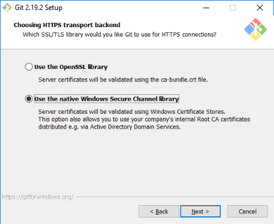

# Using Git and Github for IMSMA Core Development

* [Git](https://git-scm.com/) is a distributed version control system, that lets us manage changes to files and documents used for IMSMA Core. 
* [Github](https://github.com/GICHD/) is a website that makes Git easier to use and provides extra tools like Issue tracking.

By using github we are able to;

* Monitor and track the rollout of IMSMA Core to national authorities and other users. 
* Manage core resources for IMSMA Core, such as scripts, documents and other files.

## Getting Started

### 1. Register on Github

To access resources for IMSMA Core you need an account on Github.

You can register with [Github.com](https://github.com/join). 

If you are a member of the IM division at GICHD, or working on a rollout of IMSMA core you can request access to the [GICHD organisation](https://github.com/GICHD). 

### 2. Install Git and Github Desktop

The easiest way to use Git is to download and install [Github desktop](https://desktop.github.com/), if you are already familiar with Git command line or other options then of course these are compatible with the GICHD repositories.

If you work at the GICHD there are special steps to install and use Github on the local network* so follow this process;

a. Install and configure Git SCM for Windows

   This is the command line version of git and is required to configure Git with our proxy server.  

   1. Download [Git for Windows](https://git-scm.com/download/win)
   2. Install, ensuring you select schannel for HTTPS.     
    

      The other default options are fine unless you want to choose a favoured text editor like Notepad++ or VS Code. 
    3. Disable SSL Certificate Revocation Check 
    
       Open the command prompt and enter the following command:

        `git config --global http.schannelCheckRevoke false`

b. Install Github Desktop.  Download from [desktop.github.com](https://desktop.github.com/) and follow the wizard.

When configuring git it's a good idea to enter the anonymous github e-mail address for your account instead of your real email. This keeps your e-mail address out of the commit history.  You can find this email in your [user settings](https://github.com/settings/emails#toggle_visibility) under 'keep my email address private', for example  _123456+kes1@users.noreply.github.com_.

