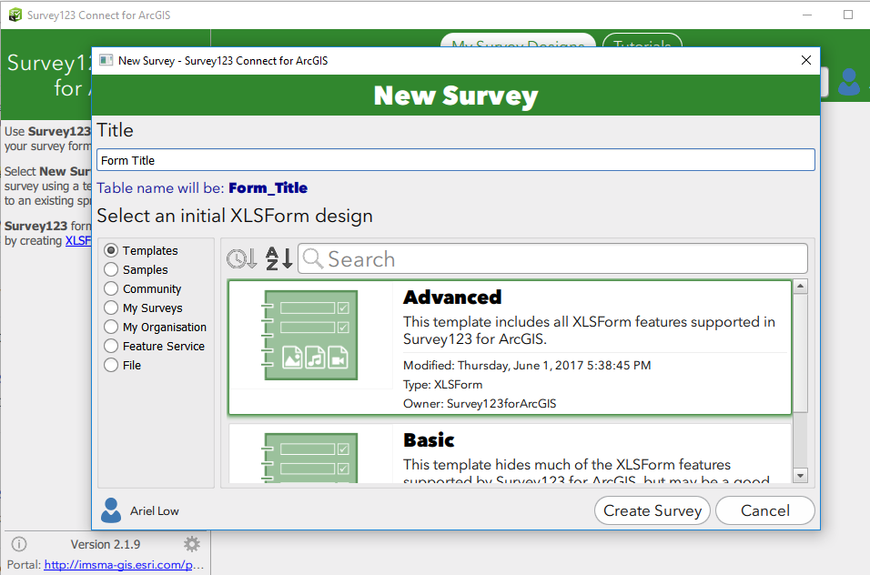
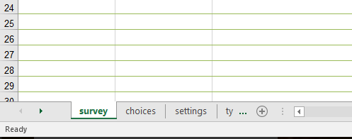
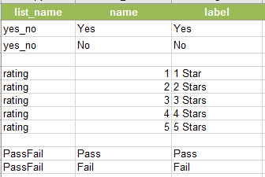
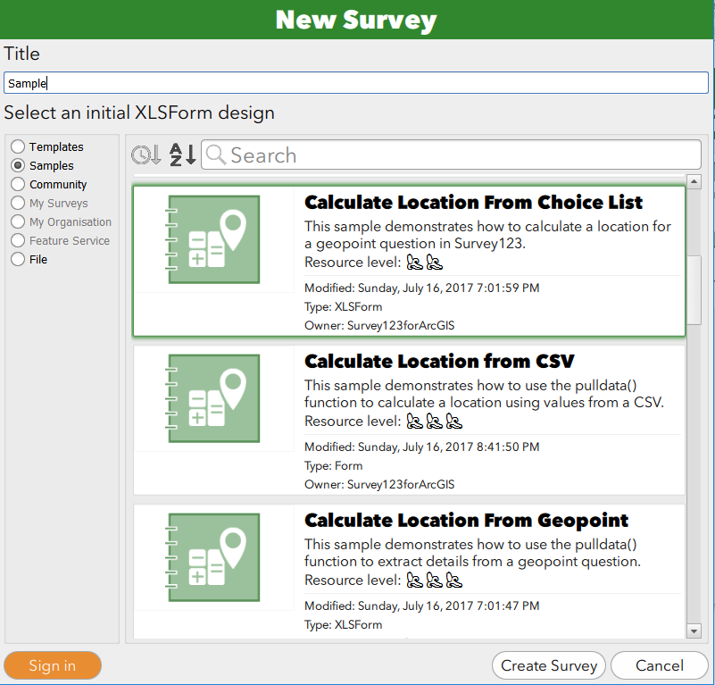
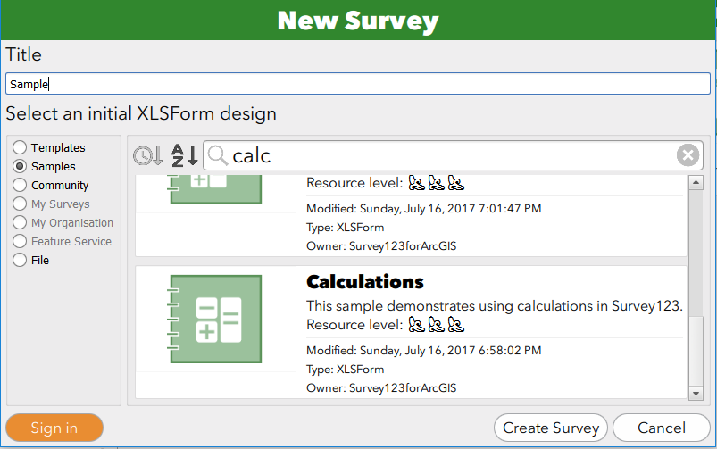
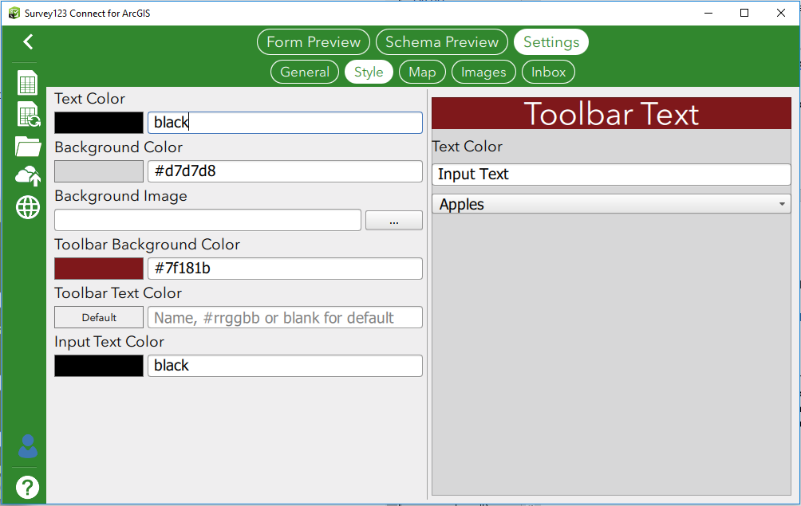
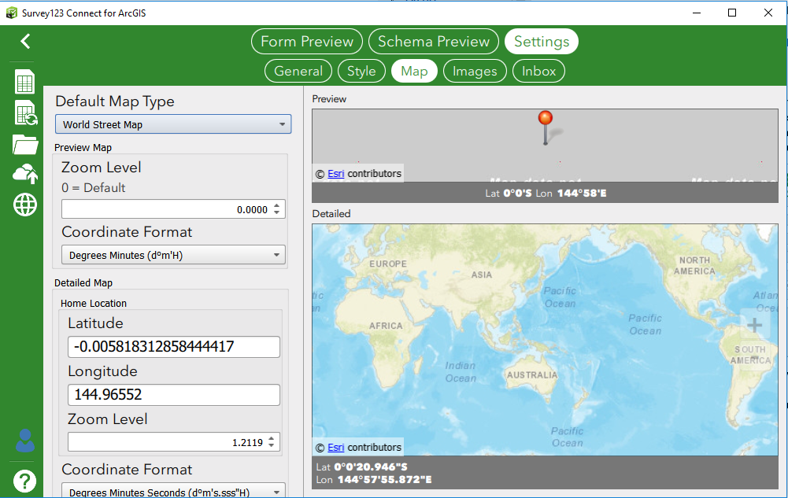

Authoring Survey123 Forms and Data
==================================

About Survey123
---------------

For an introductory video about the product click
[here](https://www.youtube.com/watch?v=jfaSlJ6BYr4&list=PLGZUzt4E4O2L7h2PdpL7st93nURZAW58d).

Creating a Survey
-----------------

For a short video tutorial click
[here](https://www.youtube.com/watch?v=utcINm0eBrU).

Options to Create a Survey
--------------------------

When you chose to create a new survey there are a variety of ways to do
this. In the New Survey interface you can select from the following
options:

-   **Templates** contains spreadsheets with no questions but with
    validation and notes on the XLSForm schema to help you start from
    scratch. 

-   **Community** allows you to create surveys based on publicly shared
    surveys.

-   **My Surveys** allows you to create surveys based on your own
    surveys stored in ArcGIS. 

-   **My Organization** allows you to create surveys based on surveys
    shared in your organization. 

-   **Feature Service** allows you to create surveys based on existing
    hosted or federated feature services shared with your organization.
    For more information click
    [here](http://doc.arcgis.com/en/survey123/desktop/create-surveys/survey123withexistingfeatureservices.htm).

-   **File** allows you to choose a spreadsheet that is saved on your
    machine or network. 

Steps to Create a Survey
------------------------

To create and publish a survey,
first [download](http://doc.arcgis.com/en/survey123/download/) and
install Survey123 Connect on your desktop computer (Windows, Mac, or
Linux). Then, complete the following steps:

1.  Start Survey123 Connect.

2.  Click **New Survey**.

    

3.  Enter a title for your survey.

    

4.  Select the initial XLSForm design you would like to use.

5.  Click **Create Survey**.

    *A new survey is created and opened for you to view. In Survey123
    Connect, you\'ll see a preview of the survey you just created.*

6.  Modify the survey as needed using the XLSForm.

    *The XLS form has four sheets: *

    -   *survey -- this sheet is where the questions in the survey are specified*

    -   *choices -- this sheet contains the choices for select\_one and select\_multiple question types*

    -   *settings -- this sheet controls the presentation and behavior of the survey*

    -   *types -- this sheet explains the format and rules of the XLS form*

7.  Click the **Publish** button 

    *Your survey is now available for download and use in the Survey123field app.*

Question Types
--------------

### Integer 

A question to record numeric, whole number values.

### Decimal

A question to record numbers with decimal places.

### Text

A question to record free text responses.

### Select One

A multiple choice question in which only one answer can be selected.

To configure:

-   Open the Choices sheet.

    

-   Create a list of the choices you'd like the user to choose from. The
    Name field must be database friendly (it cannot contains spaces or
    special characters), while the Label field is what the user will
    see.

    

-   Click back to the survey sheet.

-   In the type field select the select\_one option and replace
    \[list\_name\] with the name of the list that was created in the
    choices sheet (ex: select\_one example).

    

-   Ignore any warnings after changing the list name.

-   Add a name for the question and a label.

#### Cascading Selects

Select\_one questions can be strung together so the choice selected in
one question limits the options available to choose from in the next
question. For more information click
[here](https://geonet.esri.com/groups/survey123/blog/2015/10/22/cascading-selects-and-external-selects)
or
[here](http://doc.arcgis.com/en/survey123/desktop/create-surveys/xlsformcascadingselects.htm).

#### External Selects

For select\_one questions with a lot of choice options an external
select should be used to improve performance. For more information about
external selects click
[here](http://doc.arcgis.com/en/survey123/desktop/create-surveys/xlsformcascadingselects.htm#ESRI_SECTION1_26C265B8FFAC45C6BFDD89652C1BA7CF).

### Select Multiple

A multiple choice question in which multiple answers can be selected.

### Note

Displays text on the screen, does not take input from the user. The text
that is displayed can be a default value, the result of a calculation,
or a message that is shown based on the answer to a previous question.
Notes can contain text, images, video, or audio.

For more information about how note questions can be used to show data
based on the answer to a given question click
[here](https://geonet.esri.com/groups/survey123/blog/2016/10/27/the-pulldata-function-access-external-data).
For information about how to style notes click
[here](http://doc.arcgis.com/en/survey123/desktop/create-surveys/xlsformnotes.htm).

### Geopoint

This question type collects a single set of GPS coordinates. More
information about the parameters that are collected in a geopoint
question and can be used in other questions can be found
[here](https://geonet.esri.com/groups/survey123/blog/2016/11/03/extracting-information-from-geopoint-questions).

Geopoint questions can also be populated based on the answer to a
previous question using pulldata() in the calculation field, for more
information click
[here](http://doc.arcgis.com/en/survey123/desktop/create-surveys/geopoints.htm#ESRI_SECTION1_B1148946F7B940119DE351D84578A8B1).
There are also a number of example XLS files in the Samples section of
Survey123 Connect.

For more information about geopoints, including accuracy thresholds, 3D,
and read-only, click
[here](http://doc.arcgis.com/en/survey123/desktop/create-surveys/geopoints.htm).

### Date

A question that records dates. The month-year, year, and week-number
appearances can be used with this question type. A common default value
for this question type is today()

For more information about formatting dates and time, as well as doing
calculations with time in Survey123 click
[here](https://geonet.esri.com/groups/survey123/blog/2016/04/17/dates-and-time-in-survey123-for-arcgis).
The Survey123 field apps support Epoch time and decimal time, but the
web app only supports decimal time, for more information click
[here](http://doc.arcgis.com/en/survey123/browser/create-surveys/decimaldatetime.htm).

### Time

A question that records times. A common default value for this question
type is now().

For more information about formatting dates and time, as well as doing
calculations with time in Survey123 click
[here](https://geonet.esri.com/groups/survey123/blog/2016/04/17/dates-and-time-in-survey123-for-arcgis).
The Survey123 field apps support Epoch time and decimal time, but the
web app only supports decimal time, for more information click
[here](http://doc.arcgis.com/en/survey123/browser/create-surveys/decimaldatetime.htm).

### Date Time

A question that records dates and times. A common default value for this
question type is now().

For more information about formatting dates and time, as well as doing
calculations with time in Survey123 click
[here](https://geonet.esri.com/groups/survey123/blog/2016/04/17/dates-and-time-in-survey123-for-arcgis).
The Survey123 field apps support Epoch time and decimal time, but the
web app only supports decimal time, for more information click
[here](http://doc.arcgis.com/en/survey123/browser/create-surveys/decimaldatetime.htm).

### Image

This question type allows the user to take a photograph or attach an
existing picture. By applying the signature appearance this allows
capturing and recording signatures on a survey, which may be useful e.g.
when surveys/reports need to be printed and archived.

For information about how to access pictures collected using this
question type click
[here](https://geonet.esri.com/groups/survey123/blog/2017/03/22/working-with-your-survey123-photos).

### Begin Group

This question type begins a group of questions. It is a way of logically
grouping a set of questions under a common title and hence a way of
structuring the survey. This question type does not require a
corresponding field in the feature service.

### End Group

This question type ends a group of questions. This question type does
not require a corresponding field in the feature service.

### Begin Repeat

This question type begins a group of repeating questions. The value
entered in the name field of this question will be the name of the
related table that stores the information from the repeated questions.

### End Repeat

This question type ends a set of repeating questions.

### Calculate

This question type performs a calculation on values in the form. The
calculate field contains the outcome of the calculation. Calculate type
questions can be used to hold values that do not need to be displayed on
the form but are included in the feature service or are needed for later
questions.

For more information about the types of calculations that can be
performed click
[here](http://doc.arcgis.com/en/survey123/desktop/create-surveys/xlsformformulas.htm#ESRI_SECTION1_DB5A29AC645F4AE585D7CEA9E6D5A36B).
For information about which operators can be used in the calculations
click
[here](http://doc.arcgis.com/en/survey123/desktop/create-surveys/xlsformformulas.htm#ESRI_SECTION1_276FB773E7E2442EB81831714B08660D).
For a quick video tutorial click
[here](https://www.youtube.com/watch?v=H8RO-3RPRSU). There
is also a Calculations XLS file in the Samples section of Survey123
Connect.

### Username

When signed in with an organizational account, this question is
automatically populated with the account username, it is not seen by the
person filling out the survey.

### Email

When signed in with an organizational account, this question is
automatically populated with the account email address, it is not seen
by the person filling out the survey.

### Hidden

This question type creates a field in your feature service that is not
displayed on the form. Use the bind::esri:fieldType and
bind::esri:fieldLength columns to specify the data schema for this
field.

### Barcode

This question type scans a bar code or QR code.

For information about which types of barcodes Survey123 supports click
[here](https://geonet.esri.com/groups/survey123/blog/2016/05/17/understanding-barcode-questions-in-survey123-for-arcgis).
There is also an XLS form in the Samples section of Survey123 Connect
that has barcode examples.

### Start

This question type records the start date and time of the survey, it is
not seen by the person filling out the survey.

When you add the start and/or end types, Survey123 for ArcGIS will
automatically time-enable the feature service for your survey. Adding
the start and end entries is also useful if you want to find out exactly
how much time elapsed between the moment the form was opened and when it
was flagged as done.

### End

This question type records the end date and time of the survey, it is
not seen by the person filling out the survey.

When you add the start and/or end types, Survey123 for ArcGIS will
automatically time-enable the feature service for your survey. Adding
the start and end entries is also useful if you want to find out exactly
how much time elapsed between the moment the form was opened and when it
was flagged as done.

### Audio

This question type allows the user to record an audio clip with the
device's microphone. The recording is stored as an attachment.

XLS Form Fields
---------------

### Type

The type column sets the question type, a list can be found above, in
the Survey123
[documentation](http://doc.arcgis.com/en/survey123/desktop/create-surveys/quickreferencecreatesurveys.htm#GUID-2D96112F-85B1-4C41-9C6F-A85BB6026A51),
or in the types sheet of the XLS form.

### Name

The name is equivalent to the field name of a feature class or feature
service. It must be unique for each question in the survey form.

### Label

The label is equivalent to the alias of a feature class or service. It
is what will be seen by the user when they are filling out the form.

For information about how to use HTML formatting in the label field
click
[here](http://doc.arcgis.com/en/survey123/desktop/create-surveys/styleyourform.htm#ESRI_SECTION1_2BDD8020000A49298E5C42F939AB88F6).

### Hint

The values entered in this column will appear below the question label
and can provide the user with guidance about how to answer the question.
For more information about hints click
[here](http://doc.arcgis.com/en/survey123/desktop/create-surveys/xlsformessentials.htm#ESRI_SECTION1_5F12883901684733A54B1166BCC475A6).

### Constraint

This column defines the values that are allowed in response to the
question. This can include a specific range of numbers, combinations of
letters and numbers, or general pattern matching.

For more information about setting up constraints click
[here](http://doc.arcgis.com/en/survey123/desktop/create-surveys/xlsformformulas.htm#ESRI_SECTION1_8979CBF8B7354DA9A4FE0F6B6D61E1A0).
For information about how to reference empty values when setting up
constraints click
[here](http://doc.arcgis.com/en/survey123/desktop/create-surveys/xlsformformulas.htm#ESRI_SECTION1_2954BF95CF674951AE9691A656CF157C).

### Constraint Message

This column stores the message the user will see if their entry does not
fit within the constraints defined in the constraint field.

### Required

Entering a yes value into this column means that the question has to be
answered in order for the survey to be completed.

### Required Message

This column stores the message the user will see if they do not fill out
the required question.

### Appearance

The value in the appearance column changes the appearance and
functionality of the survey questions. For more information about the
different types of appearances click
[here](http://doc.arcgis.com/en/survey123/desktop/create-surveys/xlsformsappearance.htm).

| Appearance value | Applicable question type | Description |
| -----------------| -------------------------| ----------- |
| Signature        |Image                     | Presents a UI for signature capture. The signature will be added to the feature as an attachment.     |
| Draw             |Image                     | Allows user to open a canvas window to sketch on.                         |
| Annotate            |Image                                           | Allows user to open a canvas window to sketch on. Also supports annotation on images.                                                                |
| Minimal             |Select\_one, Select\_multiple, Barcode, Repeats | Presents choices for select\_one and select\_multiple in drop down menu. Hides the text bar for barcode questions. Hides the questions for repeats.  |
| Multiline           |Text                                            | Will make the text box multiple lines long.                                                                                                          |
| Likert              |Select\_one                                     | Makes the answer choices appear as a Likert scale.                                                                                                   |
| Month-year          |Date                                            | Select a month and year only for the date.                                                                                                           |
| Year                |Date                                            | Select only a year for the date.                                                                                                                     |
| Week-number         |Date                                            | Select a week number.                                                                                                                                |
| Distress            |Integer                                         | A highly specific widget to measure distress on a 0-10 scale.                                                                                        |
| Calculator          |Integer, Decimal                                | Displays a custom calculator widget.                                                                                                                 | 
| Numbers             |Integer, Decimal                                | Displays a custom numeric keyboard.                                                                                                                  |
| Spinner             |Integer, Decimal                                | Adds buttons to increase and decrease value.                                                                                                         |
| Horizontal          |Select\_one, Select\_multiple                   | Displays answer choices horizontally, but in columns.                                                                                                |
| Horizontal-compact  |Select\_one, Select\_multiple                   | Displays answer choices horizontally.                                                                                                                |
| Autocomplete        |Select\_one                                     | Answer choices appear in a pull-down menu, with text input to narrow down options.                                                                   |
| Compact             |Groups, Repeats                                 | Group of questions will appear collapsed on startup.                                                                                                 |
| Minimal compact     |Repeats                                         | Group of questions is displayed both collapsed and hidden.                                                                                           |
| Field-list          |Groups, Repeats                                 | Applies to groups and repeats, when style is set to pages. Displays group of questions on a separate page.                                           |
| Hide-input          |Geopoint                                        | Collapses the coordinate entry section of the widget in web form.                                                                                    |

### Default

In this column a default value that is pre-filled before the user
answers the question can be set. This is especially useful when the
majority of the time, the answer to your survey question will be the
same, but the user can still edit the default answer if required.

Default answers can hold constants, like a string, but can also support
some expressions. To draw on the answers to other questions the
Calculations column must be used. For more information about default
values click
[here](http://doc.arcgis.com/en/survey123/desktop/create-surveys/prepopulateanswers.htm#GUID-A6769D87-9AA3-46A5-9A85-E5336ADB0B5F).

### Read Only

Putting a yes value in this column means that the question response
cannot be edited. This can be used on geopoint questions if you don't
want the user to be able to edit the location.

### Relevant

The expressions entered in this column determine whether to show or hide
a question based on the relevant condition that needs to be fulfilled to
display the current question.

For more information about creating relevant expressions click
[here](http://doc.arcgis.com/en/survey123/desktop/create-surveys/xlsformrelevant.htm).
To see a list of formula operators that can be used when creating
relevant expressions click
[here](http://doc.arcgis.com/en/survey123/desktop/create-surveys/quickreferencecreatesurveys.htm#ESRI_SECTION1_C60B4E3BBB3B458B98C996F22B2599E2).

### Calculation

Calculations entered in the calculation column are often associated with
the "calculate" question type but can also be applied to integer,
decimal and text questions. The calculation column is different from the
default value column in that it can handle more expressions and it is
evaluated every time the survey answers change instead of just when the
survey opens.

For some examples of calculations click
[here](http://doc.arcgis.com/en/survey123/desktop/create-surveys/xlsformformulas.htm#ESRI_SECTION1_DB5A29AC645F4AE585D7CEA9E6D5A36B).
To see a list of formula operators that can be used when creating
calculations click
[here](http://doc.arcgis.com/en/survey123/desktop/create-surveys/quickreferencecreatesurveys.htm#ESRI_SECTION1_C60B4E3BBB3B458B98C996F22B2599E2).

### Choice Filter

The choice filter column holds the expression that evaluates the
additional columns in the choices tab based on the answer to a previous
question. Using this expression it limits the choices presented to the
user in the current question.

For more information about how to set up choice filters click
[here](https://geonet.esri.com/groups/survey123/blog/2015/10/22/cascading-selects-and-external-selects).

### Repeat Count

The repeat count column is where you can specify the exact number of
times you would like a set of questions to be repeated in order to be
able to submit the survey. This can be a set integer or the answer to a
previous question.

### Label::language1

The label is equivalent to the alias of a feature class or service. It
is what will be seen by the user when they are filling out the form.
This column contains the label that is shown when the user switches to a
different language. The language1 in the column heading should be
switched to the appropriate name used to identify the language.

For more information about how to translate survey questions click
[here](http://doc.arcgis.com/en/survey123/desktop/create-surveys/xlsformmultiplelanguagesupport.htm#GUID-452B2325-0A5B-4284-AB0A-46BFF810AAF4).
A blog post about how multiple language surveys work can be found
[here](https://geonet.esri.com/groups/survey123/blog/2016/11/16/introducing-multiple-language-surveys).

### Hint::language1

The values entered in this column will appear below the question label
and can provide the user with guidance about how to answer the question.
This column contains the hint that is shown when the user switches to a
different language. The language1 in the column heading should be
switched to the appropriate name used to identify the language.

For more information about how to translate hints click
[here](http://doc.arcgis.com/en/survey123/desktop/create-surveys/xlsformmultiplelanguagesupport.htm#ESRI_SECTION1_C0098D0882D44EBD9BC013D44AD12510).

### Media::audio

In this column the name of an audio file (including the file extension)
in the media folder of the survey can be associated with a question. For
more information about setting up audio click
[here](http://doc.arcgis.com/en/survey123/desktop/create-surveys/xlsformmedia.htm#ESRI_SECTION1_BD082EF95CA94EBEB32EBE4D50E82440).
This [blog
post](https://geonet.esri.com/groups/survey123/blog/2015/08/24/surveys-with-style)
also contains information about using audio in surveys.

### Media::image

In this column the name of an image file (including the file extension)
in the media folder of the survey can be associated with a question. For
more information about setting up images click
[here](http://doc.arcgis.com/en/survey123/desktop/create-surveys/xlsformmedia.htm#GUID-22BCA2FE-B1F5-428A-B616-1623D0D46A82).
This [blog
post](https://geonet.esri.com/groups/survey123/blog/2015/08/24/surveys-with-style)
also contains information about using images in surveys.

### Body::accuracyThreshold

This column stores the numerical accuracy threshold that you would like
associated with a given geopoint question. If the accuracy of the
geopoint is below the threshold the user will receive a warning but can
still capture the location. For more information about location accuracy
thresholds click
[here](http://doc.arcgis.com/en/survey123/desktop/create-surveys/geopoints.htm#GUID-CC769D6B-B463-4F1F-893B-F14F055FF229).

### Bind::esri:fieldType

This column can be used to control the type of field that is created in
ArcGIS for a given survey question. The values for this column that are
currently supported are:

 | Value                      | Description |
 | -------------------------- | ------------- |
 | esriFieldTypeDate          | Date |
 | esriFieldTypeSingle        | Single-precision floating point numbers |
 | esriFieldTypeDouble        | Double-precision floating point numbers |
 | esriFieldTypeInteger       | Whole numbers |
 | esriFieldTypeSmallInteger  | Small whole numbers (from -32,768 to 32,767) |
 | esriFieldTypeString        | A series of alphanumeric symbols |
 | esriFieldTypePointZ        | Adds Z axis support to geopoint question |
 | esriFieldTypeGUID          | Globally Unique Identifier |
 | null                       | Does not require field in feature service |

The default mappings for Survey123 questions are as follows:

 
 | **XLSForm Question** |  **Esri Field Type (default mapping)** |
 | --- | --- |
 | **integer**           | esriFieldTypeInteger |
 | **decimal**           | esriFieldTypeDouble |
 | **text**              | esriFieldTypeString | 
 | **select\_one**       | esriFieldTypeString |
 | **select\_multiple**  | esriFieldTypeString |
 | **note**              | Not applicable |
 | **geopoint**          | esriFieldTypeGeometry (point, WGS84, 4326) |
 | **geotrace**          | Not implemented |
 | **geoshape**          | Not implemented |
 | **date**              | esriFieldTypeDate | 
 | **time**              | esriFieldTypeDate |
 | **dateTime**          | esriFieldTypeDate |
 | **image**             | Attachment |
 | **audio**             | Not implemented |
 | **barcode**           | Attachment |
 | **video**             | Not implemented |
 | **calculate**         | esriFieldTypeString | 
 | **acknowledge**       | Not implemented |

For more information about field types click
[here](https://geonet.esri.com/groups/survey123/blog/2015/08/24/xlsform-mappings-to-arcgis-feature-services-an-introduction).

### Bind::esri:fieldLength

The value entered in this column restricts the length of the given field
in the feature service and limits the number of characters a user can
input in the question.

For more information about field length click
[here](https://geonet.esri.com/groups/survey123/blog/2015/08/24/xlsform-mappings-to-arcgis-feature-services-an-introduction).

### Bind::esri:fieldAlias

The value in this column is assigned as the field's alias in the feature
service instead of the feature service inheriting the value in the label
column, which is the default.

### Body::esri:inputMask

The values entered in this column specify the format for data entry by
using character and symbols. When you apply an input mask to a question,
all responses must follow the specific pattern defined by the input
mask. This can for example be useful for IDs that need to comply to a
specific format.

For information about the characters and symbols that can be used in an
input mask click
[here](http://doc.arcgis.com/en/survey123/desktop/create-surveys/esricustomcolumns.htm#ESRI_SECTION1_2D9AA8F82B714D7DB922D766E56FF3F6).

### Bind::esri:parameters

This field allows control over which related records will be downloaded
into the mobile device, and whether you want to make them editable or
not when the Inbox is enabled. The values for this field area as
follows:

-   **query**: The *query* parameter specifies which related
    records will be downloaded for display and/or editing purposes. By
    default, no query is set, so no related records are fetched. If you
    add something like *query='LastInspectionYear\>1995'*, only
    inspections after 1995 will be shown. You can also add a query such
    as *query='1=1'* to force all related records to be fetched. As a
    shortcut, if you simply add the parameter query with no additional
    query expression, all related records will be fetched.

<!-- -->

-   **allowUpdates**: Controls if downloaded related records
    can be edited or not. This parameter can be set to either *true*
    or *false*. If you include *allowUpdates=false*, then your
    downloaded related records will not be editable.  Just for clarity,
    if the field user adds any new additional related records, those
    will be editable even if this parameter is set to false. You will
    want to set this parameter to *false* when you do not want field
    users to edit related records that already exist in your feature
    service.

<!-- -->

-   **allowAdd**: Controls whether new rows can be added to a
    repeat. This parameter can be set to *true* or *false*, but the
    default is *true*.: i.e. *allowAdds=true*. Note that this parameter
    only affects surveys that have already been submitted (in the sent
    box) or downloaded to the *Inbox*. When collecting a new survey, new
    related rows can always be added irrespective of the parameter.

<!-- -->

-   **orderBy**: Lets you specify the order in which related
    records will be displayed within your repeat.
    e.g. *orderBy=occupant\_name* will order related records by
    the *occupant\_name* field.

To add more than one of the above parameters as key-value pairs separate
them by a space.

### Bind::saveIncomplete

This column lets you trigger autosave at specific points within your
survey. Simply add the value *true* to this column to indicate you want
to trigger autosave at that question. If you leave the entire
bind:saveInComplete column empty, Survey123 will automatically autosave
on every question.

Settings Sheet
--------------

The settings sheet of the XLSForm contains options that control the
presentation and behavior of your survey.

### Form Title

The form\_title column defines the name that is displayed in the title
area of your survey. Translations for this title can be defined in the
worksheet and will appear in your open survey.

This title is not used in the gallery of surveys or on the Download
Surveys menu. The title used in these locations is defined in Survey123
Connect on the General tab of the Settings page.

### Form ID

The form\_id column defines the name of the target layer in the feature
service that will be created (or connected) to store the answers of the
survey. If this column is empty, Survey123 will assume a form ID that is
the same name as the XLSForm file name.

For more information and to learn how to use the form\_id to point a
survey at a layer in an existing feature service click
[here](http://doc.arcgis.com/en/survey123/desktop/create-surveys/xlsformsettings.htm#ESRI_SECTION1_0930884E7F034F478EE091F6DAA1F067).

### Instance Name 

The instance\_name column defines the information used to uniquely
identify survey responses in the Survey123 field app. This is the format
in which survey responses will be labeled in the inbox, draft, outbox
and sent survey sections of the app.

For more information about setting up an instance name click
[here](http://doc.arcgis.com/en/survey123/desktop/create-surveys/xlsforminstancename.htm)
or read the [blog
post](https://geonet.esri.com/groups/survey123/blog/2017/04/24/understanding-the-instancename-setting)
about it.

### Submission URL

The submission\_url column defines an existing feature service where
your survey responses will be submitted. As this is an important feature
for IMSMA Core, more detailed information can be found here.

For more information about using Survey123 with existing feature
services click
[here](http://doc.arcgis.com/en/survey123/desktop/create-surveys/survey123withexistingfeatureservices.htm).

### Default Language

The default\_language column defines which language your survey will
initially open to.

### Version

The version column defines the name or number of the current version of
your survey. This version can be referred to in a survey question using
the version() function in the calculation column.

### Style

When pages is entered into this column groups of questions are separated
on to different pages.

For more information about setting up pages watch this
[video](https://youtu.be/Btxm888fTkM).

Additional Survey Configuration Considerations
==============================================

Styling a Survey
----------------

The General tab is located on the Settings tab. Here the name, summary
and description of the item published in ArcGIS can be edited. A
thumbnail for the form and feature service can also be set here.

The Style tab is located on the Settings tab. Styles help you control
the colors of basic elements in your survey. Colors can be customized
for the survey text, background color, toolbar text, toolbar background,
and input text. You can also use an image as the background of your
survey, but be sure that the image you\'re referencing is in the media
subfolder of your survey project folder.

The Map tab is located on the Settings tab. It allows you to choose
which default online basemap is used in your survey and set a home
location for geopoint questions. For more information about online
basemap options click
[here](http://doc.arcgis.com/en/survey123/desktop/create-surveys/includemap.htm#GUID-31B9C45D-8D07-4F0F-A33D-6C0664501D5C),
for information about associating maps for offline use with your survey
click
[here](http://doc.arcgis.com/en/survey123/desktop/create-surveys/includemap.htm#ESRI_SECTION1_C415D40743E5447E868AD60D3C25F14C).

The Images tab is located on the Settings tab. It allows you to set the
size of images submitted with your survey. The following four options
are available:

-   **Small** is 320x240 for a 4:3 photo, 320x69 for a panorama photo,
    and 320x320 for a square photo.

-   **Medium** is 640x480 for a 4:3 photo, 640x137 for a panorama photo,
    and 640x640 for a square photo.

-   **Large** is 1280x960 for a 4:3 photo, 1280x734 for a panorama
    photo, and 1280x1280 for a square photo.

-   **Unrestricted** allows any photo size to be attached to the survey.

By default, image size is set to **Medium**.

Setting up the Inbox
--------------------

Using the Inbox tab located on the Settings tab you can enable the Inbox
which allows the user to edit existing features with Survey123. This tab
is also where a query can be applied to the Inbox so field users will
only see survey responses that meet a specific condition. Using the
Inbox can be particularly relevant and useful when different users or
users from different organizations need to edit parts of the same
survey.

If you are enabling the Inbox for a survey with
repeats review the bind::esri:parameters column information.

For more information about setting up the inbox click
[here](http://doc.arcgis.com/en/survey123/desktop/create-surveys/prepareforediting.htm)
or watch this [video
tutorial](https://youtu.be/aGTPIzTtbSk).
