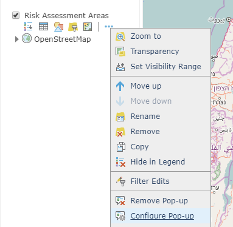
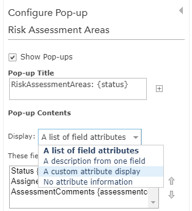
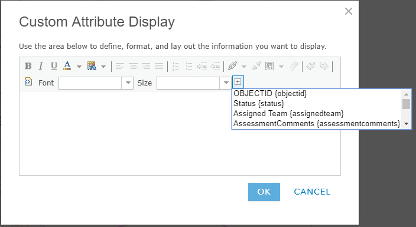
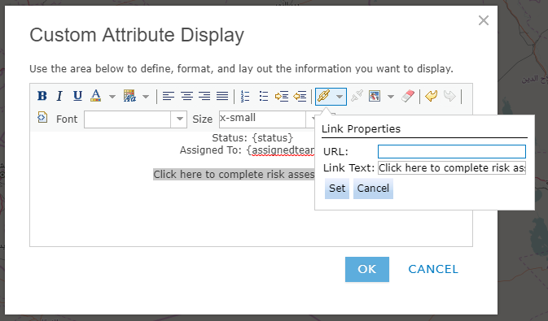

Integration of Collector and Survey123
======================================

Creating a Feature Service
--------------------------

Feature services can be created in a variety of ways:

-   Using ArcGIS Pro

-   Using ArcMap

-   Using Survey123

-   Using Templates Available through Portal

If creating feature services using Survey123 for use in other
applications note that any select\_one questions with a choice filter
will not have a domain applied and any hidden fields will be defaulted
to text unless otherwise specified with bind::esriFieldType.

Creating Custom URL Schemes
---------------------------

Through a custom URL scheme you can remotely launch apps and invoke
actions in them. Similar to the [[https://]{.underline}](http://null)
you see before web urls, a custom URL scheme directs an application to
open a specific piece of content with specific parameters, in this case
to open a survey with some questions filled in.

The custom URL should be assembled in an application like Notepad or
Microsoft Word before being added to the webmap, where it can be copied
to a new browser tab to test the result of the link.

The first part of the url is *arcgis-survey123://* 

-   This invokes the Survey123 Field app. For this to work, the
    Survey123 app must be installed in the device in which the call is
    being made.

*arcgis-survey123://*  is followed by the *itemID* parameter
(*itemID=\<surveyID\>*)

-   This refers to the survey you want to open. If the survey is not
    already in the device, the app will attempt to download it
    automatically from your currently logged in Portal

-   To find the *itemID* for a survey go to the survey's item details
    page in the Portal. At the end of the URL you will see
    **id=\<surveyed\>**. Copy the survey id and add it to your custom
    URL.

*itemID=89bc8c7844e548e09baa3aad4695e78b*

After the *itemID* parameter other parameters can be added to the custom
URL to populate the fields of the survey, separated by ampersands
between each parameter.

-   Field parameters always are prefixed with ***field:**\<fieldname\>*

-   After that comes the name of the field you want to populate, note
    this must be the name not the label

*field:AssetID*

-   Once you've specified the field after the equal (=) sign is the
    actual value that will be stored in the feature service. If you are
    working with select\_one questions this is very relevant, since the
    value you must pass is that of the XLSForm **name** of the choice,
    rather than its Label.

*field:Status=good when good is shown as "Good Condition" in the form*

-   You can use the existing attributes of a feature in the source layer
    with the custom URL and pass them into the form to prepopulate
    answers by putting the field name between curly brackets after the
    equal sign.

*field:AssetID={asset} -- where asset is a field in the existing feature
layer*

The last parameter that can be passed is where to set the location of
the primary geopoint question in the survey.

-   This is set using the *center* parameter followed by an equal sign
    and the desired coordinates.

-   You must pass a latitude-longitude pair in decimal degrees separated
    by a comma as no other coordinate systems or formats are supported.
    These coordinates can also be provided as a field from the source
    layer

*center=43.567,-117.380 or center={x\_coord},{y\_coord}*

The final result can look something like:

*arcgis-survey123://?itemID=89bc8c7844e548e09baa3aad4695e78b&field:AssetID={asset}&field:Status=Good&center=43.567,-117.380*

**Notes**

-   Passing field parameters for questions within a repeat or
    attachments is not supported at the moment.

-   Field names are case sensitive in iOS. Ensure  you reference your
    feature service fields with the exact capitalization used in the
    feature service.

-   []{#_gjdgxs .anchor}If you want to pass lat/lon values from
    attributes in your feature, please be aware that the default
    formatting rules for the double data type cut-off decimal values to
    two. You will want to eliminate the formatting rule to pass all
    decimal values to Survey123.

Creating a Webmap with Custom URLs
----------------------------------

To connect Collector to Survey123 a webmap with custom URLs in the
pop-up must be created.

1.  Add the assignments layer to a new webmap.

    a.  Click **Open in Map Viewer** on the item details page of the
        layer or click **Map** on the top bar, then search for the
        layer.

2.  Click the three dot icon under the layer name, then click
    **Configure Pop-up**.

{width="2.881741032370954in"
height="2.8140244969378827in"}

3.  Change the **Display** to **A custom attribute display**.

{width="2.547746062992126in"
height="2.7911614173228347in"}

4.  Click **CONFIGURE**.

{width="2.488336614173228in"
height="2.249838145231846in"}

5.  Use the plus sign next to the font size to add the attributes you
    want included in the pop-up. Format them as needed.

{width="3.882050524934383in"
height="2.1231003937007875in"}

6.  Add the text you would like for the hyperlink then click the link
    icon and paste the custom URL in the **URL** box, then click
    **Set**.

{width="3.873532370953631in"
height="2.2736307961504814in"}

7.  Click **OK** then click **OK** to save the pop-up configuration.
    Then click **Save** to save the map.

Preparing for Offline Use
-------------------------

Survey123 and Collector can both be used offline but some preparation
must be done prior to the user going into the field.

### Preparing Collector for Offline Use

To work offline, download the map to your device.

1.  If your map is available for download, select **Download**   to
    start downloading the map.

    a.  Only maps that can be taken offline have **Download**  on their
        map cards.

    b.  If you previously downloaded or copied a basemap to the device,
        you can reuse that basemap. When you use an existing basemap,
        you won\'t specify map detail before downloading the map.

2.  Using the map, zoom in or out as needed until you can see the entire
    work area that you need to download.

3.  Select **Map Detail** and zoom in or out until the map is showing
    the detail you need to work with in the field.

    c.  Map detail determines the quality or resolution of the map you
        download. Before downloading, make sure you can see all of the
        information you need on the map.

4.  Select **Download**.

    d.  You are taken back to the **Map Gallery** and the map downloads.

    e.  Depending on the size of your map, the download could take some
        time. During download, a progress bar displays and a cancel
        option is available.

5.  When the map has finished downloading, you can open and use the map
    without an Internet connection.

### Creating Tile Packages to use with Survey123 Offline

Survey123 supports the use of offline basemaps. These basemaps must be
of the Esri file type of tile package and web mercator projection. Tile
packages can be created using [[ArcGIS
Pro]{.underline}](http://pro.arcgis.com/en/pro-app/tool-reference/data-management/create-map-tile-package.htm)
or the [[Tile Package
Kreator]{.underline}](https://geonet.esri.com/groups/appstudio/blog/2017/02/02/tile-package-kreaor-release-11-available-now).

The Tile Package Kreator can create a copy of the tile package locally
which can then be copied directly to the mobile device or an external
storage card.

To copy the map to the device:

1.  Connect the device to the computer.

2.  Copy the map tile package.

3.  Navigate to the \~\\ArcGIS\\My Surveys\\Maps folder of your device.

4.  Right click and paste the tile package in this folder.

    a.  For example, on Windows, this is C:\\Users\\UserName\\ArcGIS\\My
        Surveys\\Maps.

    b.  When using iTunes, you will only see the ArcGIS folder and will
        be unable to browse lower into the folder tree. To save your TPK
        to the correct location, locate Survey123 and the ArcGIS folder,
        click Save To, and choose a location on your desktop. Open this
        new folder, open My Surveys \> Maps, and paste your TPK here.
        Click and drag this new folder back into the iTunes Documents
        list (the original location on the device) and when a message
        appears asking if you want to replace this folder, choose
        Replace. Other iOS file exploring apps (such as iExplorer) allow
        you to browse further into the ArcGIS folder tree and insert the
        TPK directly. If you haven\'t previously downloaded an
        associated map to your iOS device, the Maps folder may not
        already exist. You can safely create this folder before copying
        your .tpk file. For additional information on files in iTunes,
        refer to
        [[https://support.apple.com/en-au/HT201301]{.underline}](https://support.apple.com/en-au/HT201301).

5.  In the Survey123 field app, select **Menu \> Settings \> Map** and
    browse to your \~\\ArcGIS\\My Surveys\\Maps **Map Library Folder**.

    c.  Any survey that has **includeLibrary** set to **true** will now
        include any maps stored in this folder in the list of available
        maps.

### Use a Tile Package with Collector

When working offline, you can use basemaps on your device instead of
downloading a basemap for each map you use offline. This has a few
advantages: it\'s faster in most cases and allows you to prepare
basemaps for much larger areas.

1.  Plug your device in to your computer.

2.  Open iTunes, select your device, and click the **Apps** tab.

3.  Scroll to the bottom of the window and choose **Collector for
    ArcGIS** in the **File Sharing** section.

4.  Drag the tile package (.tpk) into the **Collector
    Documents** section.

5.  Once the file finishes copying, Restart Collector on your device and
    you should have access to this base map on the next map download
    operation.
